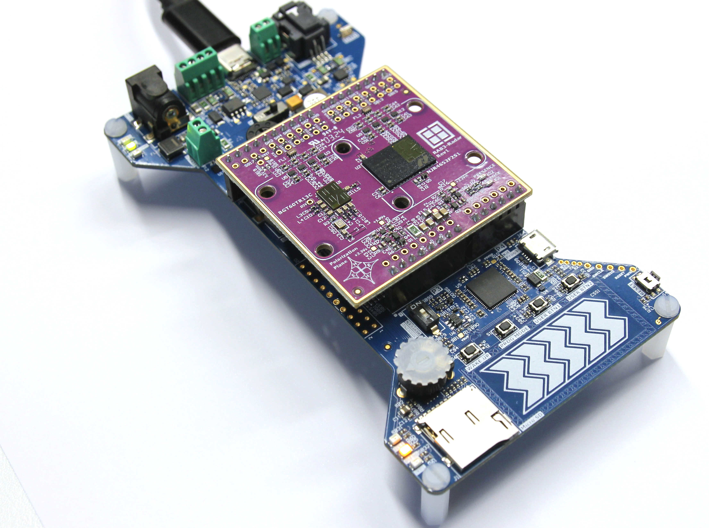
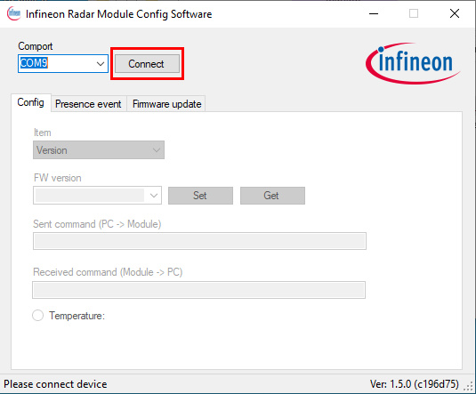
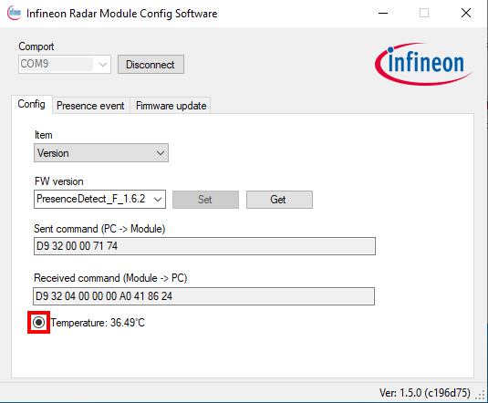
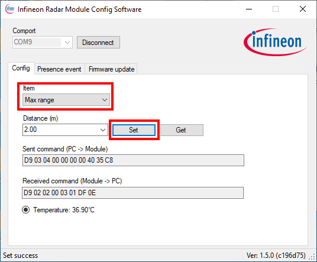
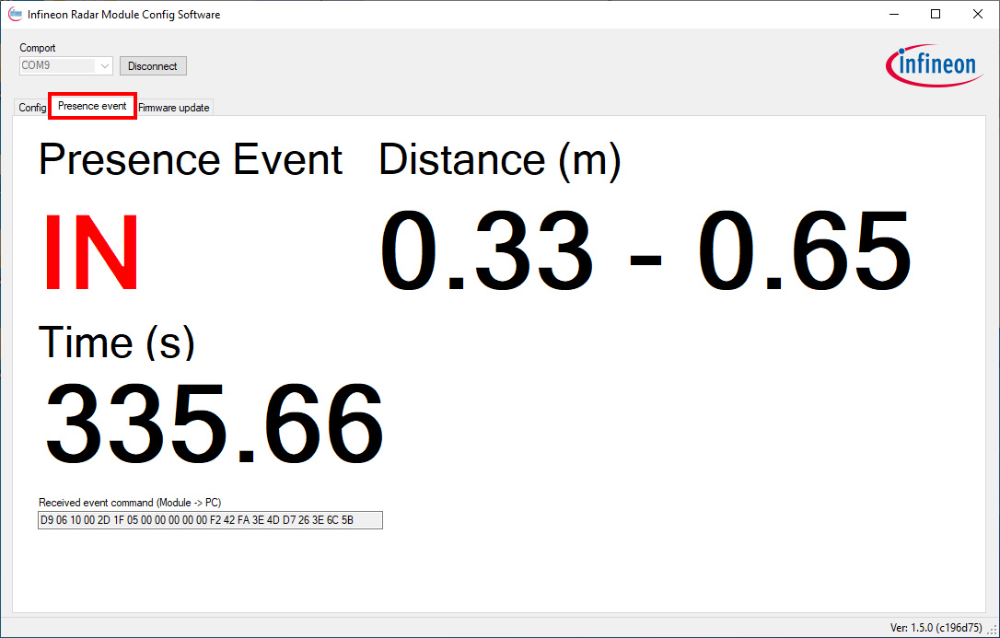

# RDK2 RAB3 NJR4652 Configuration Tool 

This ModusToolbox application enables the RDK2 development kit and RAB3-Radar adapter board to be used with the Infineon "[Config Tool](https://www.infineon.com/cms/en/applications/solutions/sensor-solutions/presence-detection/?gatedContentFileId=~%275546d4627617cd8301763cc064e22550#!designsupport)” for the configuration of the [NISSHINBO NJR4652](https://www.nisshinbo-microdevices.co.jp/en/products/sensor-modules/spec/?product=njr4652js1) radar modules.

 

Infineon "Config Tool" detects only the NJR4652F2 module of the RAB3-Radar adapter board. The BGT60TR13C part is disabled and not used in this application.

## Requirements

- [ModusToolbox® software](https://www.infineon.com/cms/en/design-support/tools/sdk/modustoolbox-software/) **v3.x** [built with **v3.1**]
- [Infineon Config Tool](https://www.infineon.com/dgdl/Infineon-BGT60TR13C_Config_Tool-Software-v02_00-EN.zip?fileId=5546d4627617cd8301763cc064e22550&da=t) [tested with **Ver: 1.5.0**]
- [RAB3-Radar Rev.0](https://github.com/RutronikSystemSolutions/RAB3_Radar_Hardware_Files/tree/main/Rev0) Rutronik Adapter Board
- [RDK2](https://github.com/RutronikSystemSolutions/RDK2_Documents) Rutronik Development Kit

## Using the code example

Create the project and open it using one of the following:

<b>In Eclipse IDE for ModusToolbox&trade; software</b>

1. Click the **New Application** link in the **Quick Panel** (or, use **File** > **New** > **ModusToolbox&trade; Application**). This launches the [Project Creator](https://www.infineon.com/ModusToolboxProjectCreator) tool.

2. Pick a RDK2 kit from the list shown in the **Project Creator - Choose Board Support Package (BSP)** dialog.

   When you select a RDK2, the example is reconfigured automatically to work with the kit. To work with a different supported kit later, use the [Library Manager](https://www.infineon.com/ModusToolboxLibraryManager) to choose the BSP for the RDK2. You can use the Library Manager to select or update the BSP and firmware libraries used in this application. To access the Library Manager, click the link from the **Quick Panel**.

   You can also just start the application creation process again and select a different kit.

   If you want to use the application for a kit not listed here, you may need to update the source files. If the kit does not have the required resources, the application may not work.

3. In the **Project Creator - Select Application** dialog, choose the RDK2_RAB3_Config_Tool example by enabling the checkbox.

4. (Optional) Change the suggested **New Application Name**.

5. The **Application(s) Root Path** defaults to the Eclipse workspace which is usually the desired location for the application. If you want to store the application in a different location, you can change the *Application(s) Root Path* value. Applications that share libraries should be in the same root path.

6. Click **Create** to complete the application creation process.

For more details, see the [Eclipse IDE for ModusToolbox&trade; software user guide](https://www.infineon.com/MTBEclipseIDEUserGuide) (locally available at *{ModusToolbox&trade; software install directory}/docs_{version}/mt_ide_user_guide.pdf*).

### Operation

After the firmware has been programmed to the RDK2 microcontroller successfully, it may be used with the Infineon Config Tool without any further adjustments. Simply connect RDK2’s USB-C port to your PC. The presence or absence indicators on the RAB3-Radar board should already be indicating either state. 

- Start your Infineon Config Tool and choose a COM port. 

  

- Click on the temperature point to be sure that communication with the NISSHINBO module works in both directions.

- You may change the *Max Range* and many other registers as it is shown below:

- The presence or absence states may be observed as it is shown below:

## Legal Disclaimer

The evaluation board including the software is for testing purposes only and, because it has limited functions and limited resilience, is not suitable for permanent use under real conditions. If the evaluation board is nevertheless used under real conditions, this is done at one’s responsibility; any liability of Rutronik is insofar excluded. 

